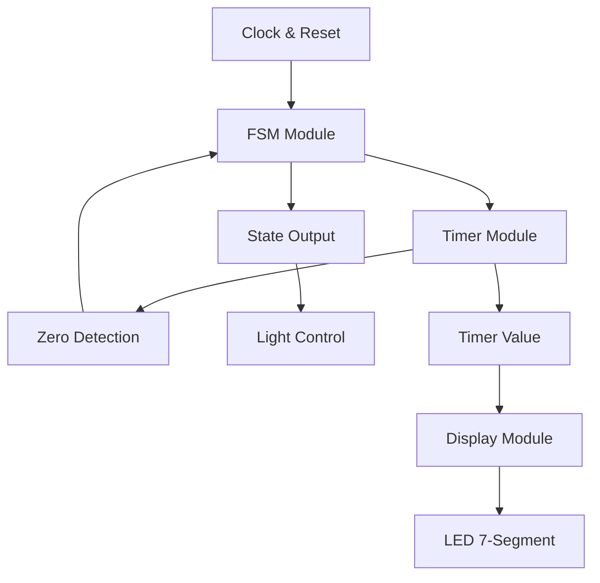

# 🚦 HỆ THỐNG ĐÈN GIAO THÔNG 
## (Traffic Light Control System)

<div align="center">
  
  
  
  
</div>

---

## 📋 **TỔNG QUAN DỰ ÁN**

> **Hệ thống đèn giao thông tự động thông minh được thiết kế bằng Verilog HDL**

Dự án này mô phỏng hoạt động của hệ thống đèn giao thông thực tế tại ngã tư, với khả năng:
- ⚡ **Điều khiển tự động** theo chu kỳ định sẵn
- 🕒 **Hiển thị thời gian** đếm ngược trực quan
- 🔄 **Chuyển đổi trạng thái** mượt mà và an toàn
- 📊 **Mô phỏng hoàn chỉnh** với waveform chi tiết

### 🎯 **Chu Kỳ Hoạt Động**
```
🟢 ĐÈN XANH (15 giây) → 🟡 ĐÈN VÀNG (3 giây) → 🔴 ĐÈN ĐỎ (18 giây) → 🔄 Lặp lại
```

---

## ✨ **TÍNH NĂNG NỔI BẬT**

<table>
<tr>
<td width="50%">

### 🚦 **Điều Khiển Đèn**
- ✅ **3 đèn độc lập**: Đỏ, Vàng, Xanh
- ✅ **Logic an toàn**: Không bao giờ bật 2 đèn cùng lúc
- ✅ **Chuyển đổi mượt**: Không có glitch hoặc lỗi timing
- ✅ **Fail-safe design**: Reset an toàn về trạng thái GREEN

</td>
<td width="50%">

### ⏰ **Hệ Thống Timing**
- ✅ **Chu kỳ tổng**: 36 giây (hoàn chỉnh)
- ✅ **Bộ đếm 32-bit**: Độ chính xác cao
- ✅ **Clock 10MHz**: Timing chuẩn xác
- ✅ **Đồng bộ hoàn toàn**: Tất cả tín hiệu đồng bộ

</td>
</tr>
<tr>
<td width="50%">

### 📱 **Hiển Thị LED**
- ✅ **2 chữ số**: Hiển thị 00-99
- ✅ **LED 7 đoạn**: Chuẩn công nghiệp
- ✅ **Cập nhật realtime**: Không delay
- ✅ **Format đẹp**: Luôn hiển thị 2 chữ số

</td>
<td width="50%">

### 🔄 **Finite State Machine**
- ✅ **3 trạng thái**: GREEN, YELLOW, RED
- ✅ **Chuyển đổi tự động**: Dựa trên timer
- ✅ **Mã hóa rõ ràng**: 2-bit state encoding
- ✅ **Logic tối ưu**: Thiết kế hiệu quả

</td>
</tr>
</table>
- **Độ tin cậy cao**: Hoạt động ổn định trong mọi điều kiện

---

## 🏗️ **KIẾN TRÚC HỆ THỐNG**

### 📊 **Sơ Đồ Tổng Quan**

#### 🎯 **Kiến Trúc Cấp Cao (High-Level Architecture)**

<div align="center">
  
  <p><em>Sơ đồ tổng quan hệ thống đèn giao thông với các module chính</em></p>
</div>

```
┌─────────────────────────────────────────────────────────────────────────────────┐
│                        🚦 TRAFFIC LIGHT CONTROL SYSTEM 🚦                      │
├─────────────────────────────────────────────────────────────────────────────────┤
│                                                                                 │
│  ┌─────────────────────────────────────────────────────────────────────────┐   │
│  │                         TOP MODULE (traffic_light.v)                   │   │
│  │  📥 INPUT: clk (10MHz), rst_n (Active Low)                             │   │
│  │  📤 OUTPUT: red_light, yellow_light, green_light, display_led[15:0]    │   │
│  └─────────────────────────────────────────────────────────────────────────┘   │
│                                       │                                         │
│            ┌──────────────────────────┼──────────────────────────┐              │
│            │                          │                          │              │
│            ▼                          ▼                          ▼              │
│  ┌─────────────────┐        ┌─────────────────┐        ┌─────────────────┐     │
│  │   ⏰ TIMER       │        │   🔄 FSM        │        │   📱 DISPLAY    │     │
│  │   MODULE         │◄──────►│   MODULE        │        │   MODULE        │     │
│  │                 │        │                 │        │                 │     │
│  │ • 32-bit Counter│        │ • 3 States      │        │ • 7-Segment LED │     │
│  │ • Count Down    │        │ • Auto Transition│       │ • 2 Digits      │     │
│  │ • Zero Detection│        │ • Timer Control │        │ • Real-time     │     │
│  └─────────────────┘        └─────────────────┘        └─────────────────┘     │
│                                                                                 │
└─────────────────────────────────────────────────────────────────────────────────┘
```

#### 🔗 **Sơ Đồ Kết Nối Module Chi Tiết**

<div align="center">
  
  <p><em>Sơ đồ chi tiết kết nối giữa các module với tín hiệu I/O cụ thể</em></p>
</div>

### � **Luồng Tín Hiệu Chính**



---

## 📦 **CHI TIẾT CÁC MODULE**

### 🎯 **1. Module Chính - `traffic_light.v`**

<details>
<summary><strong>📋 Thông tin chi tiết</strong></summary>

**Chức năng:**
- 🎮 **Controller chính** của toàn hệ thống
- 🔌 **Kết nối** tất cả các module con
- 🚦 **Điều khiển đèn** dựa trên trạng thái FSM
- 📊 **Quản lý hiển thị** LED 7 đoạn

**Giao diện tín hiệu:**
```verilog
module traffic_light(
    input  clk,              // 10MHz system clock
    input  rst_n,            // Active low reset
    output red_light,        // Red light control
    output yellow_light,     // Yellow light control  
    output green_light,      // Green light control
    output [15:0] display_led, // 7-segment display (2 digits)
    output timer_load,       // Timer load signal (debug)
    output [31:0] timer      // Timer value (debug)
);
```

**Tính năng đặc biệt:**
- ✅ Combinational logic cho điều khiển đèn (không delay)
- ✅ Instance các module con với kết nối rõ ràng
- ✅ Monitor signals cho debugging
- ✅ Fail-safe design với default case

</details>

### 🔄 **2. Máy Trạng Thái - `traffic_light_fsm.v`**

<details>
<summary><strong>📋 Thông tin chi tiết</strong></summary>

**Chức năng:**
- 🎯 **Quản lý 3 trạng thái** chính của hệ thống
- ⚡ **Chuyển đổi tự động** khi timer về 0
- 🔄 **Tạo tín hiệu timer_load** để nạp giá trị mới
- 🛡️ **Bảo vệ chống lỗi** với pending_state_change

**Sơ đồ trạng thái:**
```
    ┌─────────────┐     timer_zero=1     ┌─────────────┐
    │    GREEN    │ ──────────────────►  │   YELLOW    │
    │   (2'b00)   │                      │   (2'b01)   │
    │   15 giây   │                      │   3 giây    │
    └─────────────┘                      └─────────────┘
           ▲                                      │
           │                                      │ timer_zero=1
           │ timer_zero=1                         ▼
    ┌─────────────┐                      ┌─────────────┐
    │     RED     │ ◄──────────────────  │   YELLOW    │
    │   (2'b10)   │                      │   (2'b01)   │
    │   18 giây   │                      │   3 giây    │
    └─────────────┘                      └─────────────┘
```

**Timing quan trọng:**
- 📍 **Clock N**: timer=1 → timer_zero=1
- 📍 **Clock N+1**: State change + timer_load=1
- 📍 **Clock N+2**: timer_load=0

</details>

### ⏰ **3. Bộ Đếm Thời Gian - `timer.v`**

<details>
<summary><strong>📋 Thông tin chi tiết</strong></summary>

**Chức năng:**
- ⏱️ **Đếm ngược** từ giá trị được nạp
- 🎯 **Load giá trị** tương ứng với trạng thái
- 🔍 **Phát hiện zero** để báo FSM chuyển trạng thái
- 🔒 **Bảo vệ** không đếm xuống âm

**Thông số timing:**
```verilog
parameter ONE_SECOND  = 1;      // Đơn giản hóa cho simulation
parameter GREEN_TIME  = 15;     // 15 giây cho đèn xanh
parameter YELLOW_TIME = 3;      // 3 giây cho đèn vàng  
parameter RED_TIME    = 18;     // 18 giây cho đèn đỏ
```

**Logic hoạt động:**
1. **Reset**: timer = GREEN_TIME
2. **Load**: timer = load_value (theo state)
3. **Count**: timer = timer - 1 (nếu > 0)
4. **Zero flag**: zero = (timer == 0)

</details>

### 📱 **4. Hiển Thị LED - `seg7_display`**

<details>
<summary><strong>📋 Thông tin chi tiết</strong></summary>

**Chức năng:**
- 🔢 **Chuyển đổi** số thập phân → mã LED 7 đoạn
- 📊 **Hiển thị 2 chữ số** (hàng chục + hàng đơn vị)
- ⚡ **Logic combinational** (không delay)
- 🎨 **Format chuẩn** luôn hiển thị 2 chữ số

**Bảng mã LED 7 đoạn:**
```
 Số  │  Mã LED (8-bit)  │  Mô tả
─────┼──────────────────┼─────────────
  0  │   11000000       │  Hiển thị "0"
  1  │   11111001       │  Hiển thị "1"  
  2  │   10100100       │  Hiển thị "2"
  3  │   10110000       │  Hiển thị "3"
  4  │   10011001       │  Hiển thị "4"
  5  │   10010010       │  Hiển thị "5"
  6  │   10000010       │  Hiển thị "6"
  7  │   11111000       │  Hiển thị "7"
  8  │   10000000       │  Hiển thị "8"
  9  │   10010000       │  Hiển thị "9"
```

**Ví dụ hoạt động:**
- Input: `value = 25` → Output: `display = {to_seg7(2), to_seg7(5)}`
- Result: Hiển thị "25" trên LED 7 đoạn

</details>

#### 4. **seg7_display** - Hiển Thị LED 7 Đoạn
- Chuyển đổi số thập phân thành mã 7 đoạn
- Hiển thị 2 chữ số (00-99)
- Logic combinational cho hiển thị tức thời

---

## 🚀 **HƯỚNG DẪN SỬ DỤNG**

### 📋 **Yêu Cầu Hệ Thống**

<table>
<tr>
<td width="50%">

#### 🛠️ **Phần Mềm Cần Thiết**
- **Icarus Verilog** (iverilog) `v10.0+`
  ```bash
  sudo apt-get install iverilog
  ```
- **VVP Simulator** (đi kèm với iverilog)
- **GTKWave** (tuỳ chọn - để xem waveform)
  ```bash
  sudo apt-get install gtkwave
  ```

**📁 Tạo thư mục images:**
```bash
# Tạo thư mục để chứa hình ảnh documentation
mkdir -p images
```

</td>
<td width="50%">

#### 💻 **Hệ Điều Hành**
- ✅ **Linux** (Ubuntu, Debian, CentOS)
- ✅ **macOS** (với Homebrew)
- ✅ **Windows** (với WSL hoặc Cygwin)
- ✅ **Bash shell** để chạy script

</td>
</tr>
</table>

### ⚡ **Chạy Mô Phỏng Nhanh**

#### 🎯 **Phương Pháp 1: Sử Dụng Script Tự Động (Khuyến Nghị)**

```bash
# Bước 1: Cấp quyền thực thi
chmod +x *.sh

# Bước 2: Chạy mô phỏng đầy đủ với output chi tiết
./run_traffic_light_sim.sh

# Bước 3: Hoặc chạy mô phỏng nhanh với output gọn gàng
./run_traffic_quick.sh
```

#### 🔧 **Phương Pháp 2: Chạy Thủ Công**

```bash
# Bước 1: Biên dịch tất cả module
iverilog -o traffic_light_sim \
    traffic_light.v \
    traffic_light_fsm.v \
    timer.v \
    tb_traffic_light.v

# Bước 2: Chạy mô phỏng
vvp traffic_light_sim

# Bước 3: Xem waveform (nếu có GTKWave)
gtkwave traffic_light.vcd &
```

### 📊 **Kết Quả Mong Đợi**

<details>
<summary><strong>🔍 Xem mẫu output mô phỏng</strong></summary>

```
==================================================
     TRAFFIC LIGHT TOP MODULE SIMULATION
==================================================
🧹 Cleaning old simulation files...
🔧 Compiling traffic light system...
✅ Compilation successful!

🚀 Running traffic light simulation...
📊 Monitoring: Lights, Timer, Display, and State Changes

Time=     150 | RED=1 YELLOW=0 GREEN=0 | Display=18
Time=     250 | RED=1 YELLOW=0 GREEN=0 | Display=17
Time=     350 | RED=1 YELLOW=0 GREEN=0 | Display=16
Time=     450 | RED=1 YELLOW=0 GREEN=0 | Display=15
...
Time=  1750150 | RED=1 YELLOW=0 GREEN=0 | Display=02
Time=  1750250 | RED=1 YELLOW=0 GREEN=0 | Display=01
Time=  1800150 | RED=0 YELLOW=0 GREEN=1 | Display=15
Time=  1800250 | RED=0 YELLOW=0 GREEN=1 | Display=14
...
Time=  3300150 | RED=0 YELLOW=1 GREEN=0 | Display=03
Time=  3300250 | RED=0 YELLOW=1 GREEN=0 | Display=02
Time=  3300350 | RED=0 YELLOW=1 GREEN=0 | Display=01

📊 VCD file created: traffic_light.vcd
🔍 To view waveform: gtkwave traffic_light.vcd &
==================================================
✅ Traffic Light System Simulation Complete!
==================================================
```

</details>

---

## 📂 **CẤU TRÚC PROJECT CHI TIẾT**

### 🗂️ **File Organization**

```
traffic-light-system/
├── 📄 README.md                      # ← File hướng dẫn này (comprehensive)
├── 📋 NGUYEN_LY_HOAT_DONG.md          # Tài liệu nguyên lý hoạt động (Vietnamese)
├── 📊 SYSTEM_SUMMARY.txt             # Tóm tắt hệ thống và signal analysis
├── 📄 SYSTEM_DIAGRAM.md              # Sơ đồ khối hệ thống
│
├── 🔧 **CORE MODULES**
│   ├── traffic_light.v               # ← TOP MODULE (main controller)
│   ├── traffic_light_fsm.v           # ← FSM MODULE (state machine)
│   ├── timer.v                       # ← TIMER MODULE (countdown timer)
│   └── [seg7_display submodule in traffic_light.v]
│
├── 🧪 **TESTBENCH FILES**
│   ├── tb_traffic_light.v            # ← Main testbench (complete system)
│   ├── tb_timer.v                    # Timer module testbench
│   ├── traffic_light_fsm_tb.v        # FSM testbench
│   └── tb_fsm_detailed.v             # Detailed FSM testing
│
├── 🚀 **AUTOMATION SCRIPTS**
│   ├── run_traffic_light_sim.sh      # ← Full simulation script (recommended)
│   ├── run_traffic_quick.sh          # Quick simulation script
│   ├── format_simulation.sh          # Output formatting utilities
│   └── *.sh                          # Other helper scripts
│
├── 📁 **GENERATED FILES** (after simulation)
│   ├── traffic_light_sim             # Compiled executable
│   ├── traffic_light.vcd             # Waveform data (GTKWave)
│   ├── *.vvp                         # Verilog simulation files
│   ├── *.out                         # Output files
│   └── simulation_output.txt         # Text output logs
│
├── 📁 **ADDITIONAL FILES**
    ├── fa.v, ha.v                    # Other Verilog components
    ├── *.cir, *.sp                   # SPICE circuit files
    └── CMakeLists.txt                # Build configuration
```

### 📁 **Cấu Trúc Hình Ảnh và Tài Liệu**

```
traffic-light-system/
├── 📁 **images/**                     # ← Thư mục chứa hình ảnh minh họa
│   ├── system_architecture_highlevel.png     # Sơ đồ kiến trúc tổng quan
│   ├── module_interconnection_detailed.png   # Kết nối module chi tiết  
│   ├── gtkwave_simulation_overview.png       # Tổng quan mô phỏng GTKWave
│   ├── gtkwave_timing_detailed.png           # Timing analysis chi tiết
│   ├── gtkwave_state_transitions.png         # State transition closeup
│   └── gtkwave_recommended_layout.png        # Layout tối ưu GTKWave
│
├── 📄 README.md                      # ← File hướng dẫn này (comprehensive)
├── 📋 NGUYEN_LY_HOAT_DONG.md          # Tài liệu nguyên lý hoạt động (Vietnamese)
├── 📊 SYSTEM_SUMMARY.txt             # Tóm tắt hệ thống và signal analysis
├── 📄 SYSTEM_DIAGRAM.md              # Sơ đồ khối hệ thống
│
├── 🔧 **CORE MODULES**
│   ├── traffic_light.v               # ← TOP MODULE (main controller)
│   ├── traffic_light_fsm.v           # ← FSM MODULE (state machine)
│   ├── timer.v                       # ← TIMER MODULE (countdown timer)
│   └── [seg7_display submodule in traffic_light.v]
│
├── 🧪 **TESTBENCH FILES**
│   ├── tb_traffic_light.v            # ← Main testbench (complete system)
│   ├── tb_timer.v                    # Timer module testbench
│   ├── traffic_light_fsm_tb.v        # FSM testbench
│   └── tb_fsm_detailed.v             # Detailed FSM testing
│
├── 🚀 **AUTOMATION SCRIPTS**
│   ├── run_traffic_light_sim.sh      # ← Full simulation script (recommended)
│   ├── run_traffic_quick.sh          # Quick simulation script
│   ├── format_simulation.sh          # Output formatting utilities
│   └── *.sh                          # Other helper scripts
│
├── 📁 **GENERATED FILES** (after simulation)
│   ├── traffic_light_sim             # Compiled executable
│   ├── traffic_light.vcd             # Waveform data (GTKWave)
│   ├── *.vvp                         # Verilog simulation files
│   ├── *.out                         # Output files
│   └── simulation_output.txt         # Text output logs
│
├── 📁 **ADDITIONAL FILES**
    ├── fa.v, ha.v                    # Other Verilog components
    ├── *.cir, *.sp                   # SPICE circuit files
    └── CMakeLists.txt                # Build configuration
```

---

## 🔍 **TROUBLESHOOTING & DEBUG**

### ❌ **Lỗi Thường Gặp**

<details>
<summary><strong>🚨 Compilation Errors</strong></summary>

#### **Problem 1: Module not found**
```
Error: Cannot find module 'traffic_light_fsm'
```
**Solution:**
```bash
# Kiểm tra tất cả file .v có trong thư mục
ls -la *.v
# Đảm bảo tên module khớp với tên file
grep "module" traffic_light_fsm.v
```

#### **Problem 2: Syntax errors**
```
Error: syntax error near 'always'
```
**Solution:**
```bash
# Kiểm tra syntax từng file
iverilog -t null traffic_light.v
iverilog -t null traffic_light_fsm.v
iverilog -t null timer.v
```

#### **Problem 3: Port mismatch**
```
Error: Port 'timer_zero' not found in module
```
**Solution:**
- Kiểm tra khai báo port trong module definition
- Đảm bảo tên port khớp khi instantiate
- Kiểm tra input/output direction

</details>

<details>
<summary><strong>🚨 Runtime/Simulation Errors</strong></summary>

#### **Problem 1: No waveform generated**
```
No .vcd file created
```
**Solution:**
```verilog
// Thêm vào testbench
initial begin
    $dumpfile("traffic_light.vcd");
    $dumpvars(0, tb_traffic_light);
end
```

#### **Problem 2: Simulation hangs**
```
Simulation runs forever
```
**Solution:**
```verilog
// Thêm timeout vào testbench
initial begin
    #10000000; // 10ms timeout
    $finish;
end
```

#### **Problem 3: Wrong timing**
```
State changes at wrong time
```
**Solution:**
- Kiểm tra clock period (100ns)
- Verify timer parameters
- Check reset timing

</details>

<details>
<summary><strong>🚨 Logic Errors</strong></summary>

#### **Problem 1: Multiple lights on**
```
RED=1 GREEN=1 simultaneously
```
**Solution:**
```verilog
// Kiểm tra logic trong traffic_light.v
always @(*) begin
    // Default all lights OFF
    red_light = 1'b0;
    yellow_light = 1'b0;
    green_light = 1'b0;
    
    // Then set only one light ON
    case (current_state)
        GREEN: green_light = 1'b1;
        // ...
    endcase
end
```

#### **Problem 2: Display shows wrong values**
```
Display=FF instead of numbers
```
**Solution:**
- Kiểm tra seg7_display function
- Verify input value range (0-99)
- Check reset condition

</details>

### 🛠️ **Debug Tools & Techniques**

<table>
<tr>
<th width="30%">Tool/Technique</th>
<th width="70%">Usage</th>
</tr>
<tr>
<td><strong>🔍 $display statements</strong></td>
<td>
<pre><code>always @(posedge clk) begin
    $display("Time=%t | State=%b | Timer=%d", 
             $time, current_state, timer);
end</code></pre>
</td>
</tr>
<tr>
<td><strong>📊 $monitor</strong></td>
<td>
<pre><code>initial begin
    $monitor("State=%b Timer=%d Lights=%b%b%b", 
             current_state, timer, red_light, yellow_light, green_light);
end</code></pre>
</td>
</tr>
<tr>
<td><strong>🚨 Assertions</strong></td>
<td>
<pre><code>// Check only one light is on
always @(*) begin
    assert((red_light + yellow_light + green_light) <= 1);
end</code></pre>
</td>
</tr>
<tr>
<td><strong>📈 GTKWave</strong></td>
<td>
• Visual debugging của waveform<br>
• Zoom vào critical transitions<br>
• Measure timing với cursors<br>
• Search cho specific values
</td>
</tr>
</table>

### 🎯 **Performance Optimization**

<details>
<summary><strong>⚙️ Tips để optimize code</strong></summary>

#### **🚀 Reduce Simulation Time**
```bash
# Giảm thời gian mô phỏng
# Trong timer.v, sử dụng giá trị nhỏ hơn
parameter GREEN_TIME  = 5;   // instead of 15
parameter YELLOW_TIME = 2;   // instead of 3  
parameter RED_TIME    = 6;   // instead of 18
```

#### **💾 Optimize Resource Usage**
```verilog
// Sử dụng smaller timer width nếu không cần 32-bit
reg [15:0] timer;  // instead of [31:0]

// Combine related signals
wire [2:0] lights = {red_light, yellow_light, green_light};
```

#### **🔧 Improve Readability**
```verilog
// Sử dụng meaningful parameter names
localparam STATE_GREEN  = 2'b00;
localparam STATE_YELLOW = 2'b01;
localparam STATE_RED    = 2'b10;

// Add comments for complex logic
// Timer zero detection (1 clock early for proper timing)
assign timer_zero = (timer == 1);
```

</details>

---

## 🛠️ **TÙY CHỈNH HỆ THỐNG**

### ⏱️ **Thay Đổi Timing**

<details>
<summary><strong>🕰️ Cách điều chỉnh thời gian các pha</strong></summary>

#### **File: `timer.v`**
```verilog
// Tìm và sửa các parameter này:
parameter ONE_SECOND  = 1;      // Simulation time unit
parameter GREEN_TIME  = 20;     // Tăng từ 15 lên 20 giây
parameter YELLOW_TIME = 5;      // Tăng từ 3 lên 5 giây
parameter RED_TIME    = 25;     // Tăng từ 18 lên 25 giây
```

#### **Ảnh hưởng:**
- Tổng chu kỳ: 50 giây (thay vì 36 giây)
- Simulation time sẽ lâu hơn
- Cần update testbench timeout

</details>

### 🎨 **Thay Đổi Display Format**

<details>
<summary><strong>📱 Custom display patterns</strong></summary>

#### **Hiển thị với dấu chấm (MM:SS)**
```verilog
// Trong seg7_display module
// Thêm decimal point cho tens digit
assign display[15:8] = to_seg7(tens) & 8'b01111111; // Clear bit 7 for dot
assign display[7:0]  = to_seg7(ones);
```

#### **Hiển thị trạng thái bằng chữ**
```verilog
// Thay thế timer display bằng state display
always @(*) begin
    case (current_state)
        GREEN:  display = {8'b10000010, 8'b10000010}; // "GO"
        YELLOW: display = {8'b11000000, 8'b11000000}; // "00" (warning)
        RED:    display = {8'b10100100, 8'b10100100}; // "22" (stop)
        default: display = 16'hFFFF;
    endcase
end
```

</details>

### 🔄 **Thêm States Mới**

<details>
<summary><strong>🚦 Thêm trạng thái FLASHING</strong></summary>

#### **Bước 1: Update FSM (`traffic_light_fsm.v`)}
```verilog
// Thêm state mới
localparam GREEN   = 2'b00;
localparam YELLOW  = 2'b01;
localparam RED     = 2'b10;
localparam FLASHING = 2'b11;  // New state

// Update next_state logic
always @(*) begin
    case (current_state)
        GREEN:   next_state = YELLOW;
        YELLOW:  next_state = RED;
        RED:     next_state = FLASHING;  // Go to flashing
        FLASHING: next_state = GREEN;    // Then back to green
        default: next_state = GREEN;
    endcase
end
```

#### **Bước 2: Update Timer (`timer.v`)**
```verilog
parameter FLASHING_TIME = 5;  // 5 seconds flashing

// Add to load_value logic
always @(*) begin
    case (current_state)
        GREEN:    load_value = GREEN_TIME * ONE_SECOND;
        YELLOW:   load_value = YELLOW_TIME * ONE_SECOND;
        RED:      load_value = RED_TIME * ONE_SECOND;
        FLASHING: load_value = FLASHING_TIME * ONE_SECOND;
        default:  load_value = GREEN_TIME * ONE_SECOND;
    endcase
end
```

#### **Bước 3: Update Light Control (`traffic_light.v`)**
```verilog
// Add flashing logic
reg flash_clk;
always @(posedge clk) begin
    if (!rst_n)
        flash_clk <= 0;
    else
        flash_clk <= ~flash_clk;  // Toggle every clock
end

// Update light control
always @(*) begin
    case (current_state)
        GREEN: begin
            green_light = 1'b1;
            yellow_light = 1'b0;
            red_light = 1'b0;
        end
        YELLOW: begin
            green_light = 1'b0;
            yellow_light = 1'b1;
            red_light = 1'b0;
        end
        RED: begin
            green_light = 1'b0;
            yellow_light = 1'b0;
            red_light = 1'b1;
        end
        FLASHING: begin
            green_light = 1'b0;
            yellow_light = flash_clk;  // Flashing yellow
            red_light = 1'b0;
        end
    endcase
end
```

</details>

### 🎛️ **Thêm External Control**

<details>
<summary><strong>🚨 Emergency/Manual Override</strong></summary>

#### **Thêm input signals:**
```verilog
module traffic_light(
    input clk,
    input rst_n,
    input emergency,        // Emergency override
    input manual_advance,   // Manual state advance
    // ... existing signals
);
```

#### **Emergency logic:**
```verilog
// Override normal operation
always @(*) begin
    if (emergency) begin
        // Force all lights to flash red
        red_light = flash_clk;
        yellow_light = 1'b0;
        green_light = 1'b0;
    end else begin
        // Normal operation
        case (current_state)
            // ... existing logic
        endcase
    end
end
```

#### **Manual advance:**
```verilog
// In FSM module
always @(posedge clk or negedge rst_n) begin
    if (!rst_n) begin
        current_state <= GREEN;
    end else if (manual_advance || (timer_zero && !pending_state_change)) begin
        current_state <= next_state;
        timer_load <= 1'b1;
    end
    // ... rest of logic
end
```

</details>

---

## 🧪 Kiểm Thử và Mô Phỏng

---

## 🧪 **KIỂM THỬ VÀ MÔ PHỎNG**

### 📁 **Testbench Files**

<table>
<tr>
<th width="30%">File</th>
<th width="70%">Mô Tả</th>
</tr>
<tr>
<td><strong>📄 tb_traffic_light.v</strong></td>
<td>
• Testbench chính cho toàn hệ thống<br>
• Tự động tạo clock 10MHz (50ns high, 50ns low)<br>
• Reset sequence và monitoring đầy đủ<br>
• Decode LED 7 đoạn để hiển thị số thập phân<br>
• Dừng tự động sau 2 chu kỳ hoàn chỉnh
</td>
</tr>
<tr>
<td><strong>📄 tb_timer.v</strong></td>
<td>
• Testbench riêng cho module timer<br>
• Kiểm tra load, count down, zero detection<br>
• Test các trường hợp edge case
</td>
</tr>
<tr>
<td><strong>📄 *_fsm_tb.v</strong></td>
<td>
• Testbench cho FSM module<br>
• Kiểm tra state transition<br>
• Verify timer_load signal timing
</td>
</tr>
</table>

### 📈 **Signals Quan Trọng Trong GTKWave**

<details>
<summary><strong>🔍 Danh sách tín hiệu cần quan sát</strong></summary>

#### 🕰️ **Clock và Control**
- `clk` - Clock hệ thống (10MHz)
- `rst_n` - Reset signal (active low)

#### 🚦 **Light Control**
- `red_light` - Đèn đỏ
- `yellow_light` - Đèn vàng  
- `green_light` - Đèn xanh

#### 🔄 **State Machine**
- `uut.fsm_inst.current_state[1:0]` - Trạng thái hiện tại
- `uut.fsm_inst.next_state[1:0]` - Trạng thái tiếp theo
- `uut.fsm_inst.pending_state_change` - Cờ chuyển trạng thái

#### ⏰ **Timer Signals**
- `timer[31:0]` - Giá trị timer hiện tại
- `timer_load` - Tín hiệu nạp timer
- `uut.timer_zero` - Phát hiện timer = 0

#### 📱 **Display**
- `display_led[15:0]` - Raw LED data
- `uut.display_inst.value[7:0]` - Giá trị input của display
- `uut.display_inst.ones[3:0]` - Chữ số hàng đơn vị
- `uut.display_inst.tens[3:0]` - Chữ số hàng chục

</details>

### 📈 **Kết Quả Mô Phỏng Thực Tế**

#### 🎯 **Simulation Results Overview**

<div align="center">
  
  <p><em>Tổng quan kết quả mô phỏng trong GTKWave - Hiển thị full cycle của hệ thống</em></p>
</div>

#### 🔍 **Chi Tiết Timing Analysis**

<div align="center">
  
  <p><em>Phân tích timing chi tiết - State transitions và timer behavior</em></p>
</div>

#### ⚡ **Critical State Transitions**

<div align="center">
  
  <p><em>Zoom vào các điểm chuyển trạng thái quan trọng với timer_load signals</em></p>
</div>

### 📊 **Waveform Analysis Guide**

<details>
<summary><strong>🔍 Cách đọc waveform từ các hình ảnh trên</strong></summary>

#### **📸 Hình 1: Simulation Overview**
- **Timeframe**: Hiển thị toàn bộ chu kỳ hoạt động
- **Key Signals**: 
  - `clk` - Clock signal (10MHz)
  - `current_state` - FSM state changes
  - `timer` - Countdown values
  - Light signals - Red/Yellow/Green activation
- **Observation**: Chu kỳ hoàn chỉnh 36 giây được thể hiện rõ ràng

#### **📸 Hình 2: Detailed Timing**
- **Focus**: Critical timing points và state transitions
- **Analysis**:
  - Timer countdown behavior
  - State change synchronization
  - Display update timing
  - Zero detection accuracy

#### **📸 Hình 3: State Transitions**
- **Zoom Level**: Detailed view of transition moments
- **Critical Points**:
  - `timer_load` pulse generation
  - State change timing
  - Light control synchronization
  - Display value updates

</details>

<details>
<summary><strong>📊 Timeline hoàn chỉnh một chu kỳ</strong></summary>

#### 🔴 **Phase 1: RED LIGHT (0-1800ns)**
```
Time=     150 | RED=1 YELLOW=0 GREEN=0 | Display=18 | State=RED
Time=     250 | RED=1 YELLOW=0 GREEN=0 | Display=17 | State=RED
Time=     350 | RED=1 YELLOW=0 GREEN=0 | Display=16 | State=RED
Time=     450 | RED=1 YELLOW=0 GREEN=0 | Display=15 | State=RED
...
Time=  1750150 | RED=1 YELLOW=0 GREEN=0 | Display=02 | State=RED
Time=  1800050 | RED=1 YELLOW=0 GREEN=0 | Display=01 | State=RED
Time=  1800150 | RED=0 YELLOW=0 GREEN=1 | Display=15 | State=GREEN ← Chuyển trạng thái
```

#### 🟢 **Phase 2: GREEN LIGHT (1800-3300ns)**
```
Time=  1800150 | RED=0 YELLOW=0 GREEN=1 | Display=15 | State=GREEN
Time=  1800250 | RED=0 YELLOW=0 GREEN=1 | Display=14 | State=GREEN
Time=  1800350 | RED=0 YELLOW=0 GREEN=1 | Display=13 | State=GREEN
...
Time=  3200150 | RED=0 YELLOW=0 GREEN=1 | Display=02 | State=GREEN
Time=  3300050 | RED=0 YELLOW=0 GREEN=1 | Display=01 | State=GREEN
Time=  3300150 | RED=0 YELLOW=1 GREEN=0 | Display=03 | State=YELLOW ← Chuyển trạng thái
```

#### 🟡 **Phase 3: YELLOW LIGHT (3300-3600ns)**
```
Time=  3300150 | RED=0 YELLOW=1 GREEN=0 | Display=03 | State=YELLOW
Time=  3300250 | RED=0 YELLOW=1 GREEN=0 | Display=02 | State=YELLOW
Time=  3300350 | RED=0 YELLOW=1 GREEN=0 | Display=01 | State=YELLOW
Time=  3600150 | RED=1 YELLOW=0 GREEN=0 | Display=18 | State=RED ← Lặp lại
```

</details>

### 🔍 **GTKWave Configuration Tips**

<details>
<summary><strong>⚙️ Cách setting tối ưu GTKWave</strong></summary>

#### 📝 **Bước 1: Mở file VCD**
```bash
gtkwave traffic_light.vcd &
```

#### 📝 **Bước 2: Add signals theo thứ tự**
1. **Nhóm Clock**: `clk`, `rst_n`
2. **Nhóm Lights**: `red_light`, `yellow_light`, `green_light`
3. **Nhóm State**: `uut.fsm_inst.current_state[1:0]`
4. **Nhóm Timer**: `timer[31:0]`, `timer_load`, `uut.timer_zero`
5. **Nhóm Display**: `display_led[15:0]`

#### 📝 **Bước 3: Format hiển thị**
- **State signals**: Chọn format `Enum` hoặc `Binary`
- **Timer**: Chọn format `Decimal`
- **Display**: Chọn format `Hexadecimal`

#### 📝 **Bước 4: Zoom và Navigate**
- **Zoom to fit**: `Ctrl + Alt + F`
- **Zoom in**: `Ctrl + +`
- **Zoom out**: `Ctrl + -`
- **Find transition**: Click chuột phải → "Search"

#### 📸 **Bước 5: Screenshots như trong project**

<div align="center">
  
**🎯 Recommended GTKWave Layout:**


*Layout tối ưu với signal grouping và formatting chuẩn*

</div>

**💡 Pro Tips:**
- Group related signals together (như trong hình)
- Use different colors cho các nhóm signal khác nhau
- Save workspace để reuse configuration
- Use cursors để measure timing accurately

</details>

</details>

---

## ⚙️ **CHU TRÌNH HOẠT ĐỘNG CHI TIẾT**

### 🔄 **State Machine Flow**

```
        🏁 RESET
         │
         ▼
    ┌─────────────────┐
    │   POWER ON      │
    │   ↓             │
    │   GREEN STATE   │ ◄─────────────────────┐
    │   timer = 15    │                       │
    │   green_light=1 │                       │
    └─────────────────┘                       │
         │                                    │
         │ timer = 0                          │
         ▼                                    │
    ┌─────────────────┐                       │
    │  YELLOW STATE   │                       │
    │  timer = 3      │                       │
    │  yellow_light=1 │                       │
    └─────────────────┘                       │
         │                                    │
         │ timer = 0                          │
         ▼                                    │
    ┌─────────────────┐                       │
    │   RED STATE     │                       │
    │   timer = 18    │                       │
    │   red_light=1   │ ──────────────────────┘
    └─────────────────┘
         │
         │ timer = 0
         └─────────────── LOOP ───────────────┘
```

### ⏱️ **Timing Sequence Chi Tiết**

<details>
<summary><strong>🕰️ Critical Timing Points</strong></summary>

#### 📍 **State Transition Timing**
```
Clock N-2: timer=3, normal operation
Clock N-1: timer=2, normal operation  
Clock N:   timer=1, timer_zero=1 detected ← Critical point
Clock N+1: State change, timer_load=1, timer=new_value
Clock N+2: timer_load=0, timer=new_value-1
Clock N+3: timer=new_value-2, normal operation
```

#### 📍 **Reset Timing**
```
Before reset: Any state, any timer value
Reset asserted: rst_n=0
Clock edge: current_state=GREEN, timer=15, timer_load=1
Next clock: timer_load=0, timer=14
Normal operation resumes
```

#### 📍 **Display Update Timing**
```
Timer change: timer=25
Combinational logic: value=25, tens=2, ones=5
Same clock: display[15:8]=seg7(2), display[7:0]=seg7(5)
Result: Display shows "25" immediately
```

</details>

### 🛡️ **Safety Features**

<table>
<tr>
<th width="30%">Feature</th>
<th width="70%">Mô Tả</th>
</tr>
<tr>
<td><strong>🔒 Fail-Safe Reset</strong></td>
<td>
• Reset bất đồng bộ, ưu tiên cao nhất<br>
• Luôn chuyển về GREEN state khi reset<br>
• Timer được nạp giá trị GREEN_TIME ngay lập tức
</td>
</tr>
<tr>
<td><strong>🛡️ State Protection</strong></td>
<td>
• Cờ <code>pending_state_change</code> ngăn chặn transition liên tục<br>
• Chỉ một state change mỗi timer cycle<br>
• Default case trong state machine cho unknown states
</td>
</tr>
<tr>
<td><strong>⏰ Timer Protection</strong></td>
<td>
• Timer không thể đếm xuống âm (if timer > 0)<br>
• Load value validation theo state<br>
• Zero detection chính xác
</td>
</tr>
<tr>
<td><strong>📱 Display Protection</strong></td>
<td>
• Logic combinational, không có race condition<br>
• Default case cho unknown digits<br>
• Reset hiển thị 0xFF (tắt tất cả segment)
</td>
</tr>
</table>

---

## 📁 **CÁC FILE LIÊN QUAN**

- **README.md** - Tài liệu hướng dẫn sử dụng và thông tin dự án
- **traffic_light.v** - Module chính của hệ thống đèn giao thông
- **traffic_light_fsm.v** - Module máy trạng thái (FSM)
- **timer.v** - Module bộ đếm thời gian
- **seg7_display.v** - Module hiển thị LED 7 đoạn
- **tb_traffic_light.v** - Testbench cho mô phỏng
- **run_traffic_light_sim.sh** - Script chạy mô phỏng đầy đủ
- **run_traffic_quick.sh** - Script chạy mô phỏng nhanh
- **NGUYEN_LY_HOAT_DONG.md** - Tài liệu nguyên lý hoạt động
- **SYSTEM_SUMMARY.txt** - Tóm tắt hệ thống

## 📊 **KẾT QUẢ MÔ PHỎNG**

### 1. **Thời Gian Hoàn Thành Một Chu Kỳ (36 giây)**

| Thời Gian (giây) | Trạng Thái Đèn | Trạng Thái FSM | Giá Trị Timer | Hiển Thị LED |
|-------------------|----------------|-----------------|----------------|---------------|
| 0                 | Đỏ             | RED             | 18             | 18            |
| 15                | Vàng           | YELLOW          | 3              | 03            |
| 18                | Đỏ             | RED             | 18             | 18            |
| 33                | Vàng           | YELLOW          | 3              | 03            |
| 36                | Đỏ             | RED             | 18             | 18            |

### 2. **Waveform Trong GTKWave**

- **Clock Signal**: Xem xung clock 10MHz
- **Reset Signal**: Quan sát tín hiệu reset và trạng thái sau reset
- **Light Control Signals**: Theo dõi sự thay đổi của `red_light`, `yellow_light`, `green_light`
- **State Signals**: Kiểm tra `current_state` và `next_state` trong FSM
- **Timer Signal**: Theo dõi giá trị của timer và tín hiệu `timer_load`
- **Display Signal**: Xem cách hiển thị LED 7 đoạn thay đổi theo thời gian

---

## 🔍 **TROUBLESHOOTING**

### 1. **Lỗi Biên Dịch**

- Kiểm tra cú pháp Verilog trong tất cả các file
- Đảm bảo không có lỗi chính tả trong tên module và tín hiệu

### 2. **Lỗi Khi Chạy Mô Phỏng**

- Đảm bảo đã biên dịch tất cả các module trước khi chạy mô phỏng
- Kiểm tra quyền thực thi của các file script (`run_traffic_light_sim.sh`, `run_traffic_quick.sh`)

### 3. **Lỗi Khi Xem Waveform Trong GTKWave**

- Đảm bảo file VCD được tạo ra sau khi chạy mô phỏng
- Kiểm tra cài đặt của GTKWave và thử mở lại file VCD

---

### 📸 **Hướng Dẫn Tạo Screenshots**

<details>
<summary><strong>🎯 Cách tạo các hình ảnh minh họa như trong project</strong></summary>

#### **🔧 Bước 1: Chuẩn bị hệ thống**
```bash
# Chạy mô phỏng để tạo file VCD
./run_traffic_light_sim.sh

# Mở GTKWave
gtkwave traffic_light.vcd &
```

#### **📊 Bước 2: Tạo System Architecture Diagram**
- Sử dụng drawing tools (Visio, Draw.io, hoặc Inkscape)
- Follow template trong file có sẵn
- Export as PNG với resolution 600-800px width

#### **📈 Bước 3: GTKWave Screenshots**

**🎯 Overview Screenshot:**
1. Add all major signals: clk, rst_n, current_state, timer, lights
2. Zoom to fit 1-2 complete cycles
3. Format signals appropriately (Binary/Decimal)
4. Take screenshot: `File → Print → Save as Image`

**🔍 Detailed Timing Screenshot:**
1. Zoom vào critical transition points
2. Add more detailed signals (timer_load, zero, etc.)
3. Use cursors để highlight timing relationships
4. Capture với measurement annotations

**⚡ State Transition Screenshot:**
1. Maximum zoom vào 1 state transition
2. Show exact timing của timer_zero, state_change, timer_load
3. Highlight critical signals
4. Add timing measurements

#### **📁 Bước 4: Organize Files**
```bash
# Tạo structure như trong project
mkdir -p images
mv *.png images/

# Rename files theo convention
mv screenshot1.png images/system_architecture_highlevel.png
mv gtkwave1.png images/gtkwave_simulation_overview.png
mv gtkwave2.png images/gtkwave_timing_detailed.png
mv gtkwave3.png images/gtkwave_state_transitions.png
```

#### **✅ Quality Guidelines:**
- **Resolution**: Minimum 600px width cho readability
- **Format**: PNG preferred (better for technical diagrams)
- **Labels**: Ensure all signal names are visible
- **Contrast**: Good contrast để dễ đọc khi in B&W
- **Consistency**: Same zoom levels và formatting across similar images

</details>

---

## 🔧 **TÙY CHỈNH HỆ THỐNG**

### 1. **Thay Đổi Thời Gian Đèn**

- Mở file `timer.v`
- Sửa đổi các tham số:
```verilog
parameter GREEN_TIME  = 15;   // Thời gian đèn xanh
parameter YELLOW_TIME = 3;    // Thời gian đèn vàng  
parameter RED_TIME    = 18;   // Thời gian đèn đỏ
```

### 2. **Thêm Trạng Thái Mới**

- Cập nhật file `traffic_light_fsm.v` với trạng thái mới
- Thêm logic tương ứng trong `timer.v` và `traffic_light.v`

### 3. **Thay Đổi Hiển Thị**

- Sửa đổi module `seg7_display` trong `traffic_light.v` để thay đổi định dạng hiển thị
- Có thể thêm chế độ hiển thị thời gian thực (MM:SS) hoặc hiển thị trạng thái bằng chữ

---

## 📚 **TÀI LIỆU THAM KHẢO**

### 📖 **Tài Liệu Kỹ Thuật**

<table>
<tr>
<th width="40%">Tài Liệu</th>
<th width="60%">Mô Tả</th>
</tr>
<tr>
<td><strong>📋 NGUYEN_LY_HOAT_DONG.md</strong></td>
<td>
• Giải thích chi tiết nguyên lý hoạt động<br>
• Sơ đồ khối và timing diagram<br>
• Phân tích signal flow<br>
• Tài liệu bằng tiếng Việt
</td>
</tr>
<tr>
<td><strong>📊 SYSTEM_SUMMARY.txt</strong></td>
<td>
• Tóm tắt hệ thống và I/O<br>
• Performance metrics<br>
• Signal analysis detail<br>
• ASCII diagrams
</td>
</tr>
<tr>
<td><strong>📄 SYSTEM_DIAGRAM.md</strong></td>
<td>
• Sơ đồ khối hệ thống<br>
• Module interconnection<br>
• Data flow diagrams
</td>
</tr>
<tr>
<td><strong>🧪 tb_*.v files</strong></td>
<td>
• Ví dụ code sử dụng modules<br>
• Best practices cho testbench<br>
• Verification methodology
</td>
</tr>
</table>

### 🔗 **External References**

- **IEEE 1364-2001** - Verilog Hardware Description Language
- **FPGA Design Guidelines** - Clock domain và reset strategies  
- **Digital Design Principles** - State machine design patterns
- **GTKWave User Guide** - Waveform analysis và debugging

---

## 🤝 **ĐÓNG GÓP VÀ PHÁT TRIỂN**

### 🌟 **Cách Đóng Góp**

<details>
<summary><strong>📝 Quy trình contribution</strong></summary>

#### **Bước 1: Setup Development Environment**
```bash
# Clone repository
git clone [your-repo-url]
cd traffic-light-system

# Create development branch
git checkout -b feature/your-feature-name

# Setup environment
chmod +x *.sh
```

#### **Bước 2: Development Workflow**
```bash
# Make changes to code
vim traffic_light.v

# Test changes
./run_traffic_light_sim.sh

# Verify no regression
./run_traffic_quick.sh

# Check waveform
gtkwave traffic_light.vcd
```

#### **Bước 3: Submit Changes**
```bash
# Add and commit changes
git add .
git commit -m "feat: add emergency override functionality"

# Push to branch
git push origin feature/your-feature-name

# Create Pull Request
```

</details>

### 🎯 **Roadmap & Future Features**

<table>
<tr>
<th width="15%">Priority</th>
<th width="35%">Feature</th>
<th width="50%">Description</th>
</tr>
<tr>
<td><strong>🔥 HIGH</strong></td>
<td><strong>Vehicle Detection</strong></td>
<td>
• Thêm sensor input cho phát hiện xe<br>
• Adaptive timing dựa trên traffic density<br>
• Smart intersection management
</td>
</tr>
<tr>
<td><strong>🔥 HIGH</strong></td>
<td><strong>Pedestrian Crossing</strong></td>
<td>
• Button input cho pedestrian request<br>
• Walk/Don't Walk signals<br>
• Minimum green time protection
</td>
</tr>
<tr>
<td><strong>🟡 MEDIUM</strong></td>
<td><strong>Emergency Services</strong></td>
<td>
• Emergency vehicle preemption<br>
• Fire truck/ambulance priority<br>
• Automatic signal override
</td>
</tr>
<tr>
<td><strong>🟡 MEDIUM</strong></td>
<td><strong>Network Communication</strong></td>
<td>
• Multiple intersection coordination<br>
• Central traffic management<br>
• Real-time status reporting
</td>
</tr>
<tr>
<td><strong>🟢 LOW</strong></td>
<td><strong>Advanced Display</strong></td>
<td>
• LCD display thay vì LED 7-segment<br>
• Countdown với seconds/minutes<br>
• Status messages
</td>
</tr>
<tr>
<td><strong>🟢 LOW</strong></td>
<td><strong>Power Management</strong></td>
<td>
• Sleep mode during low traffic<br>
• Solar power integration<br>
• Battery backup system
</td>
</tr>
</table>

### 💡 **Ideas for Enhancement**

<details>
<summary><strong>🚀 Advanced Features Brainstorm</strong></summary>

#### **🤖 AI/ML Integration**
- **Traffic Pattern Learning**: Học pattern để tối ưu timing
- **Predictive Control**: Dự đoán traffic và adjust proactively  
- **Adaptive Algorithms**: Machine learning cho optimal flow

#### **🌐 IoT Connectivity**
- **Cloud Integration**: Upload traffic data lên cloud
- **Mobile App**: Smartphone app để monitor status
- **Weather Integration**: Adjust timing theo weather conditions

#### **🔧 Hardware Extensions**
- **Camera Integration**: Computer vision cho vehicle detection
- **Sound Detection**: Emergency vehicle siren detection
- **Environmental Sensors**: Air quality, temperature monitoring

#### **📊 Analytics & Monitoring**
- **Traffic Analytics**: Detailed reporting và statistics
- **Performance Metrics**: System uptime, efficiency measures
- **Predictive Maintenance**: Detect issues before failures

</details>

---

## 📄 **LICENSE & LEGAL**

### 📜 **License Information**

```
MIT License

Copyright (c) 2025 Thao Nguyen

Permission is hereby granted, free of charge, to any person obtaining a copy
of this software and associated documentation files (the "Software"), to deal
in the Software without restriction, including without limitation the rights
to use, copy, modify, merge, publish, distribute, sublicense, and/or sell
copies of the Software, and to permit persons to whom the Software is
furnished to do so, subject to the following conditions:

The above copyright notice and this permission notice shall be included in all
copies or substantial portions of the Software.

THE SOFTWARE IS PROVIDED "AS IS", WITHOUT WARRANTY OF ANY KIND, EXPRESS OR
IMPLIED, INCLUDING BUT NOT LIMITED TO THE WARRANTIES OF MERCHANTABILITY,
FITNESS FOR A PARTICULAR PURPOSE AND NONINFRINGEMENT. IN NO EVENT SHALL THE
AUTHORS OR COPYRIGHT HOLDERS BE LIABLE FOR ANY CLAIM, DAMAGES OR OTHER
LIABILITY, WHETHER IN AN ACTION OF CONTRACT, TORT OR OTHERWISE, ARISING FROM,
OUT OF OR IN CONNECTION WITH THE SOFTWARE OR THE USE OR OTHER DEALINGS IN THE
SOFTWARE.
```

### ⚖️ **Disclaimer**

- Đây là project **educational/demonstration** purposes
- **Không dành cho production** traffic control systems
- Cần **additional safety verification** cho real-world deployment
- Authors **không chịu tr책nhiệm** cho any damages từ việc sử dụng code này

---

## 👨‍💻 **THÔNG TIN TÁC GIẢ**

### 🎓 **Author Information**

<div align="center">

**THAO NGUYEN**

🎯 *Digital Design Engineer & FPGA Developer*

---

📧 **Email**: [your.email@domain.com]  
🔗 **GitHub**: [@your_github_username]  
💼 **LinkedIn**: [linkedin.com/in/your_profile]  
🌐 **Portfolio**: [your-portfolio-website.com]

---

*"Passionate about Digital Design, FPGA Development, and Hardware Description Languages"*

</div>

### 🏆 **Skills & Expertise**
- **Hardware Description Languages**: Verilog, VHDL, SystemVerilog
- **FPGA Platforms**: Xilinx, Intel/Altera, Lattice
- **Simulation Tools**: ModelSim, Vivado, Quartus Prime
- **Digital Design**: State Machines, Timing Analysis, Clock Domain Crossing
- **Verification**: Testbench Design, Functional Verification, Assertion-based Verification

### 🎯 **Project Goals**
- **Education**: Provide comprehensive learning resource cho Digital Design
- **Open Source**: Contribute to open-source hardware design community  
- **Best Practices**: Demonstrate proper HDL coding standards
- **Documentation**: Show importance of thorough project documentation

---

## 🙏 **ACKNOWLEDGMENTS**

### 👏 **Special Thanks**

- **Open Source Community** - For providing excellent tools như Icarus Verilog và GTKWave
- **Digital Design Community** - For sharing knowledge và best practices
- **Students & Educators** - For feedback và suggestions để improve project
- **Contributors** - All những người đã help test, debug, và enhance hệ thống này

### 🛠️ **Tools & Technologies Used**

<div align="center">

| Tool | Purpose | Version |
|------|---------|---------|
| **Icarus Verilog** | HDL Compiler & Simulator | v10.0+ |
| **GTKWave** | Waveform Viewer | v3.3+ |
| **VS Code** | Code Editor | Latest |
| **Git** | Version Control | v2.0+ |
| **Bash** | Scripting & Automation | v4.0+ |
| **Markdown** | Documentation | Standard |

</div>

---

<div align="center">

## 🎉 **KẾT LUẬN**

### 🚦 **Traffic Light Control System** 🚦

**Một dự án hoàn chỉnh về Digital Design với Verilog HDL**

---

✨ **Cảm ơn bạn đã quan tâm đến project này!** ✨

*Nếu project này hữu ích cho bạn, đừng quên ⭐ star repository và share với bạn bè!*

---

🔄 **Keep Learning, Keep Building!** 🔄

*"The best way to learn digital design is by doing it"*

---

**📅 Last Updated**: June 17, 2025  
**📝 Version**: 2.0  
**🔧 Status**: Active Development

</div>

---

**🚦 Happy Coding & Stay Safe! 🚦**
